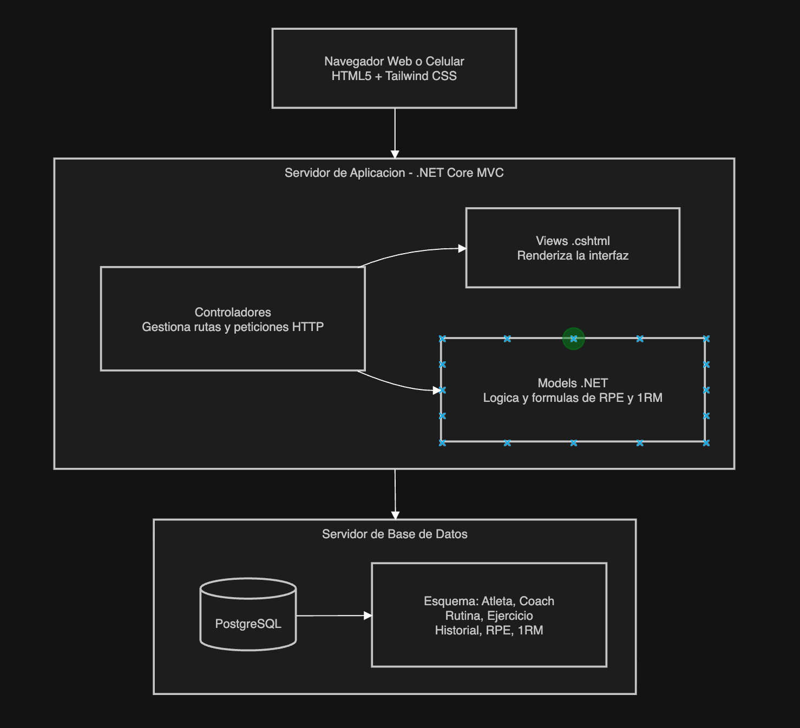
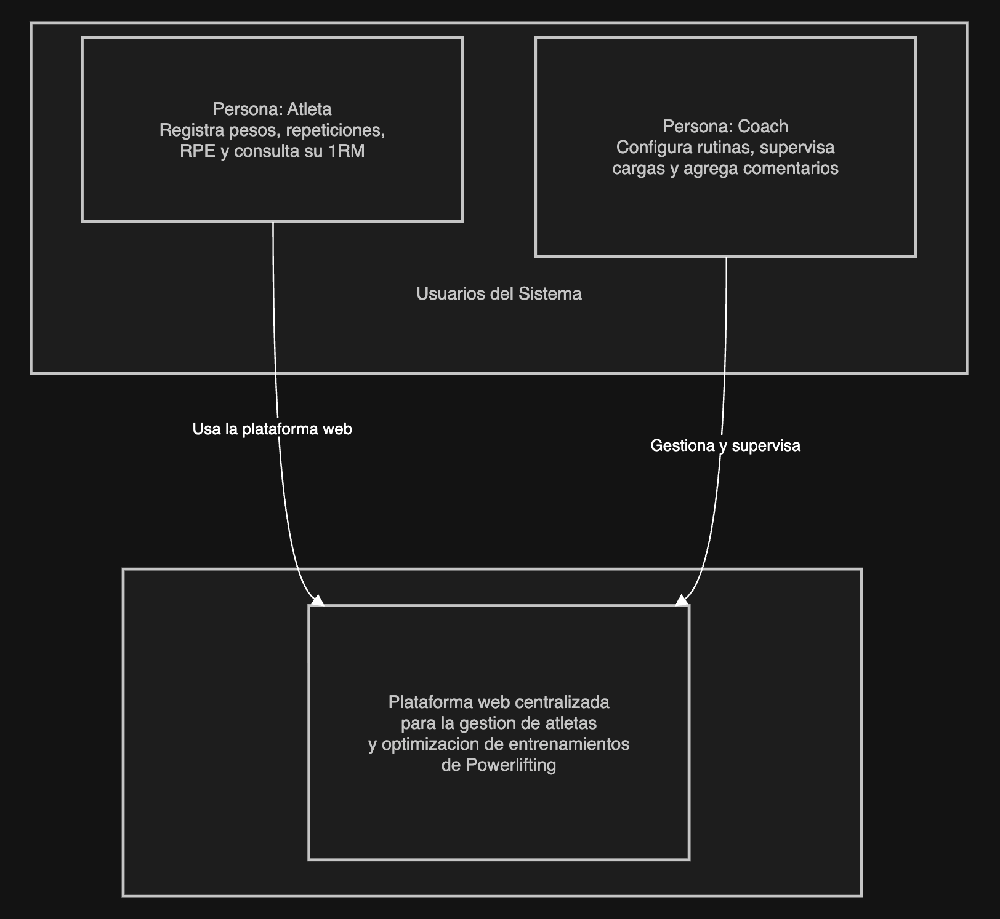
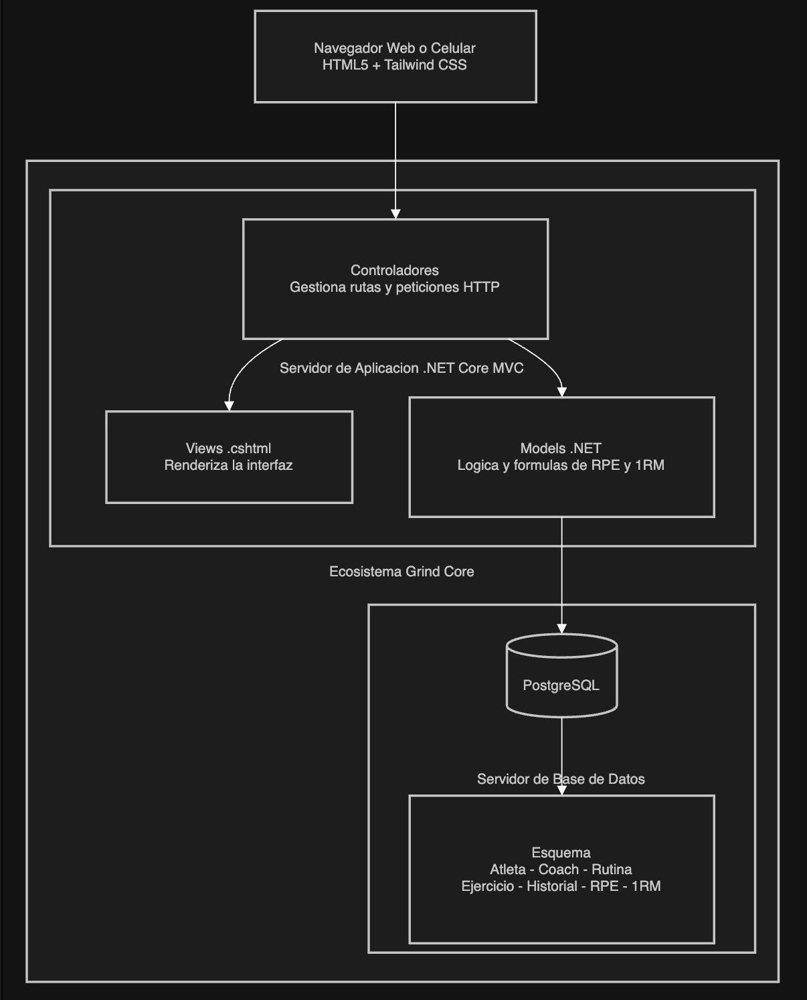
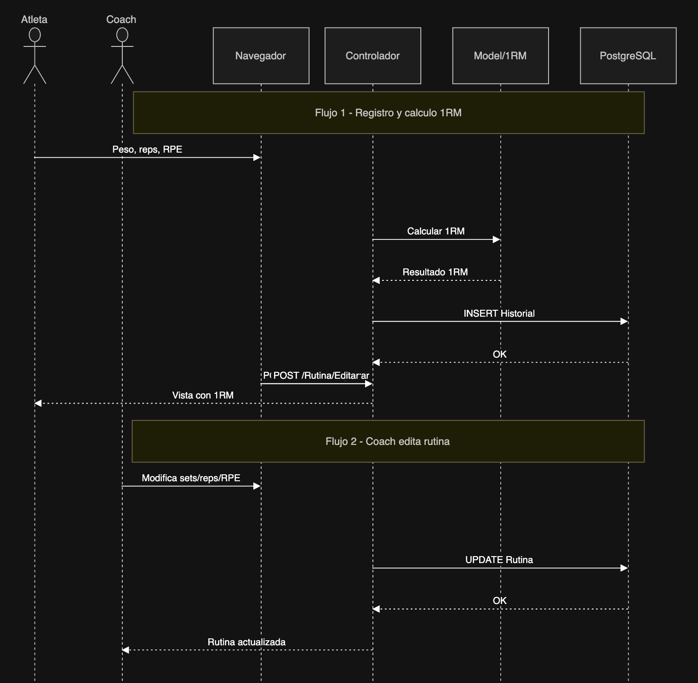

# ADR-02: Definición y Documentación de Vistas Arquitectónicas y Actualización de Runtime

| Campo  | Valor |
|--------|-------|
| Autor  | Joshua Cruz |
| Fecha  | 05/06/2026 |
| Estado | `Aceptado` |

---

## Contexto

Grind Core es una plataforma web centralizada diseñada para la gestión de atletas de Powerlifting y la optimización de entrenamientos basados en autorregulación. El sistema cuenta con dos roles principales definidos en nuestro modelo de contexto (C1): el **Atleta**, quien registra pesos, repeticiones y RPE; y el **Coach**, quien configura rutinas y supervisa cargas de trabajo. 

Para avanzar en el desarrollo y garantizar un estándar técnico riguroso, se va a documentar formalmente las decisiones de diseño mediante el modelo de vistas arquitectónicas, asegurando una separación clara de responsabilidades lógicas, dinámicas y de infraestructura. Además, surge la necesidad de evaluar el entorno de ejecución idóneo para mitigar la latencia en cálculos matemáticos pesados en tiempo real (estimaciones de fuerza y fatiga).

---

## Decisión

Se decide adoptar formalmente el **Modelo de Vistas Arquitectónicas (Lógica, Procesos, Física y Despliegue)** para estandarizar la documentación técnica del sistema Grind Core. 

Como parte de esta definición de vistas, se toman las siguientes determinaciones tecnológicas específicas:
1. **Vista Lógica:** Mantener el patrón **.NET MVC**, pero migrar formalmente el entorno de ejecución de .NET Core a **.NET 10** para aprovechar las optimizaciones de rendimiento del JIT, recolección de basura optimizada y menor consumo de memoria. Los controladores canalizarán las peticiones HTTP y los modelos encapsularán tanto el esquema de PostgreSQL como las fórmulas de Powerlifting.
2. **Vista Física y Despliegue:** Adoptar un modelo híbrido descentralizado donde la base de datos **PostgreSQL** se aloja de manera administrada de forma remota (ej. Supabase/Neon) y el Servidor de Aplicación .NET 10 se despliega de forma independiente para facilitar escalabilidad horizontal futura.

### ¿Por qué?

- **Rendimiento Puro (.NET 10):** El procesamiento dinámico de algoritmos de powerlifting (calcular el e1RM instantáneo basándose en tablas de RPE y alertar sobre sobrecargas indeseadas) requiere la menor latencia de backend posible. .NET 10 ofrece mejoras críticas de compilación nativa AOT y optimizaciones de hardware para procesadores de silicio.
- **Trazabilidad de Procesos:** Definir una Vista de Procesos permite mitigar condiciones de carrera y asegurar que las transacciones de actualización de récords personales (PRs) mantengan una secuencia lógica estricta y predecible.
- **Alineación con Diagramas C1/C2:** Las vistas físicas y lógicas expanden de forma directa el contenedor detallado en nuestro diseño estático previo, permitiendo mapear los componentes en HTML5/Tailwind y .NET de manera fidedigna.

### Alternativas consideradas

| Alternativa | Por qué la descarté |
|-------------|---------------------|
| **Documentación única mediante C4 Model (C1-C4)** | Aunque es excelente para vistas estáticas, el estándar de la materia solicita explícitamente el enfoque multi-vista clásica para evaluar la concurrencia y despliegue físico por separado. |
| **Arquitectura Limpia (Clean Architecture) con Capas Desacopladas** | Hubiera implicado separar el proyecto en múltiples bibliotecas de clases separadas (.Core, .Infrastructure, .Web). Se descarta momentáneamente para mantener la simplicidad inicial sobre el modelo .NET 10 MVC nativo en un solo ensamblado. |
| **Permanecer en .NET Core / .NET 8** | Aunque es estable, carece de las últimas optimizaciones en el manejo de memoria eficiente y rendimiento en ejecución concurrente que introduce .NET 10 para sistemas de analíticas deportivas. |

---

## Consecuencias

** Lo que gano:**
- **Técnica:** Mayor rendimiento y velocidad de respuesta del backend al procesar fórmulas de entrenamiento gracias a .NET 10. Estructuración formal de la infraestructura que facilita la migración rápida a entornos productivos en la nube.
- **Proceso o equipo:** Comprensión total de los flujos del sistema en tiempo de ejecución. Cualquier nuevo desarrollador sabrá exactamente qué canal físico o lógico sigue la información desde que se digita en la pantalla hasta que impacta la base de datos PostgreSQL.

**Lo que sacrifico o asumo:**
- **Limitación técnica:** Al mantener la lógica dentro del modelo MVC tradicional en un monolito, si las fórmulas de RPE se vuelven extremadamente complejas, los Modelos de .NET podrían sobrecargarse de responsabilidades (deuda técnica a mitigar extrayendo servicios en el futuro).
- **Deuda o riesgo:** Migrar a .NET 10 (versión ultra-reciente) puede generar ligeras incompatibilidades iniciales con ciertas herramientas ORM o librerías secundarias de terceros que aún no estén completamente actualizadas.

---

## Diagramas de las Vistas Arquitectónicas

A continuación, se detallan las 4 vistas arquitectónicas requeridas para el ecosistema **Grind Core**:

### 1. Vista Lógica
Muestra la organización del código en componentes lógicos basados en el patrón MVC dentro de la solución de .NET 10.

### 2. Vista de Procesos
Representa el flujo dinámico, la comunicación y el comportamiento en tiempo de ejecución cuando un atleta registra sus series de entrenamiento.

### 3. Vista Física
Define la topología de hardware y los nodos físicos sobre los cuales corre el software durante el desarrollo del proyecto.

### 4. Vista de Despliegue
Muestra cómo se distribuyen los componentes del sistema en un entorno real de producción en la nube de forma descentralizada.

---

## Declaración de IA 

Sí se utilizó IA para la realización de este ADR, principalmente para los mermaid de los diagramas que después se pasaron a Draw.io.
